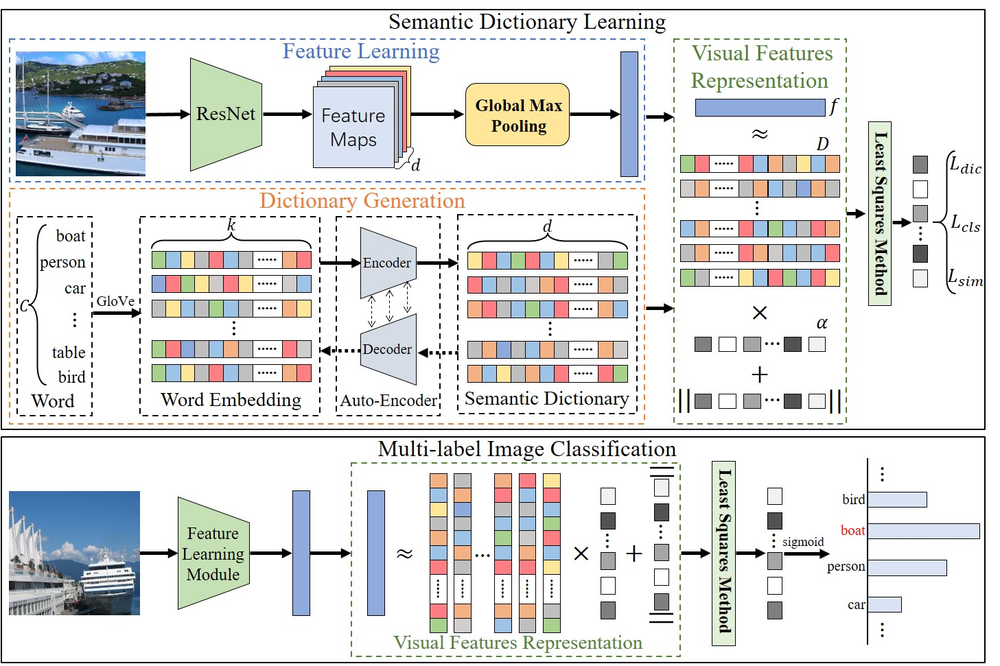

# Improving Deep Semantic Dictionary Learning for Multi-label Image Classification

Based on the paper: "[Deep Semantic Dictionary Learning for Multi-label Image Classification](https://ojs.aaai.org/index.php/AAAI/article/view/16472)" (AAAI 2021) by Fengtao Zhou, Sheng Huang, Yun Xing.

Original source code: [DSDL](https://github.com/FT-ZHOU-ZZZ/DSDL)

**Abstract:**  
The application of semantic dictionary learning in image classification is currently underexplored. Deep Semantic Dictionary Learning (DSDL) model has shown promising potential in multi-label image classification in comparison to other past multi-label classification models. DSDL introduces semantic dictionary which captures the semantic relationship of the label and visual space.
Our work aims to improve the performance of this model, with the focus being the modification of 2 parts of the model: feature learning module and dictionary generation. In the feature learning module, we experiments with the introduction of neural attention and replacing the ResNet101 with other more efficient pre-trained models. For the dictionary generation, we experimented with increasing the complexity of encoder-decoder layers.
Our modification on the model shows improvement on VOC2007 and VOC2012 dataset with accuracy of 95.85 and 95.01, comparing to the original DSDL's accuracy of 94.81 and 93.64.

**Original DSDL model**


The DSDL model is divided into 3 modules:
1. Feature learning module
2. Dictionary generation module
3. Visual features representation module

Our work focuses on improving the feature learning and dictionary generation module.


## Environment

Python 3.8.10

PyTorch 1.13.0

Torchvision 0.14.0


## Implementation details
Following is the summary of our implementation. More details can be found in the source code.
### Original model
- Feature learning module: [ResNet101](https://arxiv.org/abs/1512.03385) (PyTorch's implementation) <br/>
  - The pre-trained weights in the original implementation is replaced by PyTorch's default pre-trained weights due to deprecation.
- Dictionary generation module: Autoencoder with shared weights in the encoder and decoder

### Our model
- Feature learning module: [EfficientNetV2](https://arxiv.org/abs/2104.00298) (PyTorch's implementation) <br/>
  - PyTorch's default pre-trained weights are used.
  - The last 1x1 convolutional layer is modified to extract a 2048D feature vector.
- Dictionary generation module: Autoencoder with disjoint weights in the encoder and decoder


## Datasets
#### [PASCAL VOC2007](http://host.robots.ox.ac.uk/pascal/VOC/voc2007/)
PASCAL VOC2007 dataset is subdivided into **20 classes**.

* Person: person
* Animal: bird, cat, cow, dog, horse, sheep
* Vehicle: aeroplane, bicycle, boat, bus, car, motorbike, train
* Indoor: bottle, chair, dining table, potted plant, sofa, tv/monitor

For multi-label image classification, VOC 2007 dataset is divided into
**training (2,501)**, **validation (2,510)** and **testing (4,952)** sets.

#### [Pascal VOC2012](http://host.robots.ox.ac.uk/pascal/VOC/voc2012/)
The VOC2012 dataset is divided into **training (5,717)**, **validating (5,823)** and **testing (10,991)** set. The classes are the same as the VOC2007 dataset. <br />
The ground truth labels of the test set are not provided, so we submitted our testing results to the **[evaluation server](http://host.robots.ox.ac.uk:8080/)**. Further description and instruction can be found on the website.

## Download pre-trained models
To use the pre-trained models, download the following checkpoints and move them to the corresponding directories specified below. The hyperparameters used to train these models can be found in [voc2007/run_voc2007.sh](https://github.com/kaiitunnz/CS470-Team-9-Improving-DSDL/blob/f6980e24eddec91bb3fe1ce0a705d603cfba7faa/voc2007/run_voc2007.sh#L12) and [voc2007/run_voc2012.sh](https://github.com/kaiitunnz/CS470-Team-9-Improving-DSDL/blob/f6980e24eddec91bb3fe1ce0a705d603cfba7faa/voc2012/run_voc2012.sh#L12).

voc2007/checkpoint/voc2007 ([GoogleDrive](https://drive.google.com/file/d/1Hn_r5ulqnvcN_8JQQQvOv1CsZQQQjMxa/view?usp=sharing))

voc2012/checkpoint/voc2012 ([GoogleDrive](https://drive.google.com/file/d/12tyTS-35FiQuSnSxGN08HJ0t8oqJteb3/view?usp=sharing))

### Demo VOC2007

```sh
cd voc2007
bash run_voc2007
```

### Demo VOC2012

```sh
cd voc2012
bash run_voc2012
```

## Experimental Results
### Performance comparison on the VOC2007 dataset
|    Method    | aero  |  bike |  bird |  boat | bottle|  bus  |  car  |  cat  | chair |  cow  | table |  dog  | horse | motor | person| plant | sheep |  sofa | train |   tv  | mAP |
|:------------:|:-----:|:-----:|:-----:|:-----:|:-----:|:-----:|:-----:|:-----:|:-----:|:-----:|:-----:|:-----:|:-----:|:-----:|:-----:|:-----:|:-----:|:-----:|:-----:|:-----:|:---:|
|HCP           | 98.6  |	97.1  |	98.0  |	95.6  |	75.3  |	94.7  |	95.8  |	97.3  |	73.1  |	90.2  |	80.0  |	97.3  |	96.1  |	94.9  |	96.3  |	78.3  |	94.7  |	76.2  |	97.9  |	91.5  |	90.9|
|CNN-RNN       | 96.7  |	83.1  |	94.2  |	92.8  |	61.2  |	82.1  |	89.1  |	94.2  |	64.2  |	83.6  |	70.0  |	92.4  |	91.7  |	84.2  |	93.7  |	59.8  |	93.2  |	75.3  |	99.7  |	78.6  |	84.0|
|ResNet-101    | 99.5  |	97.7  |	97.8  |	96.4  |	65.7  |	91.8  |	96.1  |	97.6  |	74.2  |	80.9  |	85.0  |	98.4  |	96.5  |	95.9  |	98.4  |	70.1  |	88.3  |	80.2  |	98.9  |	89.2  |	89.9|
|FeV+LV        | 97.9  |	97.0  |	96.6  |	94.6  |	73.6  |	93.9  |	96.5  |	95.5  |	73.7  |	90.3  |	82.8  |	95.4  |	97.7  |	95.9  |	98.6  |	77.6  |	88.7  |	78.0  |	98.3  |	89.0  |	90.6|
|RCP           | 99.3  |	97.6  |	98.0  |	96.4  |	79.3  |	93.8  |	96.6  |	97.1  |	78.0  |	88.7  |	87.1  |	97.1  |	96.3  |	95.4  |	99.1  |	82.1  |	93.6  |	82.2  |	98.4  |	92.8  |	92.5|
|RDAR          | 98.6  |	97.4  |	96.3  |	96.2  |	75.2  |	92.4  |	96.5  |	97.1  |	76.5  |	92.0  |	87.7  |	96.8  |	97.5  |	93.8  |	98.5  |	81.6  |	93.7  |	82.8  |	98.6  |	89.3  |	91.9|
|RMIC          | 97.1  |	91.3  |	94.2  |	57.1  |	86.7  |	90.7  |	93.1  |	63.3  |	83.3  |	76.4  |	92.8  |	94.4  |	91.6  |	95.1  |	92.3  |	59.7  |	86.0  |	69.5  |	96.4  |	79.0  |	84.5|
|RLSD          | 96.4  |	92.7  |	93.8  |	94.1  |	71.2  |	92.5  |	94.2  |	95.7  |	74.3  |	90.0  |	74.2  |	95.4  |	96.2  |	92.1  |	97.9  |	66.9  |	93.5  |	73.7  |	97.5  |	87.6  |	88.5|
|RARL          | 98.6  |	97.1  |	97.1  |	95.5  |	75.6  |	92.8  |	96.8  |	97.3  |	78.3  |	92.2  |	87.6  |	96.9  |	96.5  |	93.6  |	98.5  |	81.6  |	93.1  |	83.2  |	98.5  |	89.3  |	92.0|
|ML-GCN        | 99.5  |	98.5  |	98.6  |	98.1  |	80.8  |	94.6  |	97.2  |	98.2  |	82.3  |	95.7  |	86.4  |	98.2  |	98.4  |	96.7  |	99.0  |	84.7  |	96.7  |	84.3  |	98.9  |	93.7  |	94.0|
|CoP           | 99.9  |	98.4  |	97.8  |	98.8  |	81.2  |	93.7  |	97.1  |	98.4  |	82.7  |	94.6  |	87.1  |	98.1  |	97.6  |	96.2  |	98.8  |	83.2  |	96.2  |	84.7  |	99.1  |	93.5  |	93.8|
|Original DSDL (repro.) | 99.6 | 98.6 | 98.8 | 98.4 | 83.0 | 98.0 | 97.7 | 98.3 | 81.3 | 96.5 | 89.1 | 99.2 | 98.5 | 98.3 | 99.1 | 85.4 | 99.1 | 83.4 | 98.4 | 95.4  |	94.8  |
|Our DSDL   | 99.9  |	98.9  |	98.6  |	98.2  |	84.0  |	98.0  |	98.2  |	98.6  |	86.5  |	97.7  |	92.1  |	99.3  |	98.9  |	98.6  |	99.1  |	88.8  |	98.5  | 87.1  |	99.5  |	96.6  |	95.8  |


### Performance comparison on the VOC2012 dataset
|    Method    | aero  |  bike |  bird |  boat | bottle|  bus  |  car  |  cat  | chair |  cow  | table |  dog  | horse | motor | person| plant | sheep |  sofa | train |   tv  | mAP |
|:------------:|:-----:|:-----:|:-----:|:-----:|:-----:|:-----:|:-----:|:-----:|:-----:|:-----:|:-----:|:-----:|:-----:|:-----:|:-----:|:-----:|:-----:|:-----:|:-----:|:-----:|:---:|
|VGG19+SVM     | 99.1  | 88.7  | 95.7  | 93.9  | 73.1  | 92.1  | 84.8  | 97.7  | 79.1  | 90.7  | 83.2  | 97.3  | 96.2  | 94.3  | 96.9  | 63.4  | 93.2  | 74.6  | 97.3  | 87.9  | 89.0|
|HCP           | 99.1  | 92.8  | 97.4  | 94.4  | 79.9  | 93.6  | 89.8  | 98.2  | 78.2  | 94.9  | 79.8  | 97.8  | 97.0  | 93.8  | 96.4  | 74.3  | 94.7  | 71.9  | 96.7  | 88.6  | 90.5|
|FeV+LV        | 98.4  | 92.8  | 93.4  | 90.7  | 74.9  | 93.2  | 90.2  | 96.1  | 78.2  | 89.8  | 80.6  | 95.7  | 96.1  | 95.3  | 97.5  | 73.1  | 91.2  | 75.4  | 97.0  | 88.2  | 89.4|
|RCP           | 99.3  | 92.2  | 97.5  | 94.9  | 82.3  | 94.1  | 92.4  | 98.5  | 83.8  | 93.5  | 83.1  | 98.1  | 97.3  | 96.0  | 98.8  | 77.7  | 95.1  | 79.4  | 97.7  | 92.4  | 92.2|
|RMIC          | 98.0  | 85.5  | 92.6  | 88.7  | 64.0  | 86.8  | 82.0  | 94.9  | 72.7  | 83.1  | 73.4  | 95.2  | 91.7  | 90.8  | 95.5  | 58.3  | 87.6  | 70.6  | 93.8  | 83.0  | 84.4|
|RLSD          | 96.4  | 92.7  | 93.8  | 94.1  | 71.2  | 92.5  | 94.2  | 95.7  | 74.3  | 90.0  | 74.2  | 95.4  | 96.2  | 92.1  | 97.9  | 66.9  | 93.5  | 73.7  | 97.5  | 87.6  | 88.5|
|DELTA         |   -   |   -   |   -   |   -   |   -   |   -   |   -   |   -   |   -   |   -   |   -   |   -   |   -   |   -   |   -   |   -   |   -   |   -   |   -   |   -   | 90.3|
|Original DSDL (repro.) | 99.4 | 95.1 | 98.0 | 96.9 | 84.0 | 94.9 | 94.5 | 99.0 | 85.5 | 95.8 | 83.5 | 98.6 | 97.7 | 96.5 | 98.6 | 83.3 | 97.6 | 81.1 | 98.4 | 94.5 | 93.6|
|Our DSDL  | 99.8  | 96.9  | 98.0  | 98.0  | 87.0  | 96.7  | 95.2  | 99.3  | 88.5  | 98.1  | 87.2  | 98.9  | 99.3  | 97.0  | 98.8  | 84.3  | 98.9  | 84.1  | 99.0  | 95.2  | 95.0|
